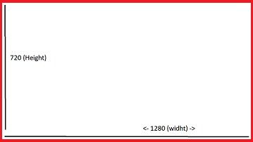

# <r># </r>About Image
##### These are some well known resolution we came to know daily.
<g>Name</g>|<g>Resolution</g>
-|-
HD | 1280x720
FHD | 1920x1080
UHD(4k) | 3840x2160

##### Note: 1280x720 : 1280(width) and 720(height)

# <r># </r>Type of Image
1. Binary image 
    1. 2 bit image
    2. 2 levels in image (0 and 1)
2. Other types are:
    1. 6 levels
    2. 16 levels
    3. 256 levels (8 bit image) means 1 black 1 white and 254 grey shades
3. Grey Scaled Image
    1. 8 bit image
    2. 256 levels (8 bit image) means 1 black 1 white and 254 grey shades

4. Colores Image(RGB)
    1. three grey scale images
    2. it represent the intensity or shades of red, green, blue
    3. 3 channels

##### Note: As the levels increased details in image get increased
##### Note: No of pixels in HD is 1280x720x3(3 from number of channel)

# <r># </r> About Pixels
* 1 inch = 2.54 cm
* Generally we consider a screen with <g>_96 dpi_</g>
* Desity of pixels = 96dpi = 96dpcm/2.54 = 38(approx)dpcm
* So 1 cm contains 38 pixels